# 🚀 1 Line that saves $1K: Incremental Aggregations with dbt + Python

**PyCon 2025 Talk Demo**

> **TL;DR**: One line that saves $1,000/month in Compute costs. This repo shows you how. 🎯

## 💰 The Cost Savings Story

**The Problem:** Calculating daily revenue aggregations (running total) requires scanning entire history every day.

**Before (Full Batch):**

- Scans: **5 TB per day** 📊
- Cost: **$6.25/TB × 5 TB = $31.25/day** 💸
- Monthly: **~$937.50** 😱
- **Why?** Need to recalculate running totals from scratch

**After (Incremental Aggregation):**

- Scans: **~200 GB per day** (only 14-day window) ⚡
- Cost: **$6.25/TB × 0.2 TB = $1.25/day** 🎉
- Monthly: **~$37.50** ✨
- **Why?** Only reprocess sliding window, preserve older data

**Savings: ~$900/month ≈ $1,000/month** 💰

**The Magic Line:**

```sql
materialized='incremental'
```

That's it. That's the line. One line. $1K saved. 🎯

By configuring your aggregation model as incremental, dbt only processes new/changed data instead of scanning the entire history. Combined with a sliding window filter (e.g., `WHERE order_date >= CURRENT_DATE() - INTERVAL 14 DAYS`), you get efficient incremental updates that handle late-arriving events.

This project demonstrates a progressive journey through incremental data processing patterns using dbt and DuckDB. It showcases three increasingly sophisticated approaches: full batch processing, incremental event processing, and incremental aggregation with sliding window using DuckDB's `delete+insert` strategy.

**The repo is optimized for live demos**: everything runs locally in Docker, requires no external cloud credentials, and can be reset quickly. No credit card required! 💳✨

---

### What's inside 🎁

- **dbt project** targeting DuckDB with staging and incremental aggregation models
- **Python models** 🐍 demonstrating DuckDB Python API with PyArrow batch processing (v1, v2, v3)
- **SQL models** for comparison - same patterns, different syntax
- **Three progressive demos** showing the evolution from "scan everything" to "scan smart" 💡
- **Generated Store Transaction Data** 🛒 - Simulated store data (orders, revenue, buyers) over 90 days with realistic patterns
- **Data generation script** that generates realistic store transaction data and exports as Hive-partitioned Parquet files using DuckDB
- **DuckDB** embedded database for fast analytical queries (no external services needed!)
- **Marimo** 📊 interactive notebook for visualizing revenue analytics (runs on port 8080)
- **dbt documentation** 📚 automatically generated documentation server (runs on port 8081)
- **Docker Compose** orchestration for the entire stack (because who likes dependency hell? 😅)

---

### The Journey: Three Progressive Demos 🎬

```mermaid
graph LR
    subgraph V1["Demo 01: Full Batch 🔥"]
        V1_Staging[Staging: Table<br/>Rebuilds ALL]
        V1_Agg[Aggregation: Table<br/>Rebuilds ALL]
        V1_Cost[$31.25/day]
        V1_Staging --> V1_Agg --> V1_Cost
    end

    subgraph V2["Demo 02: Full Incremental ⚡"]
        V2_Staging[Staging: Incremental<br/>Last 7 days ✅]
        V2_Agg[Aggregation: Incremental<br/>Last 7 days ✅]
        V2_Cost[$1.25/day]
        V2_Staging --> V2_Agg --> V2_Cost
    end

    subgraph V3["Demo 03: Incremental + Sliding Window 🎯"]
        V3_Staging[Staging: Incremental<br/>Last 7 days ✅]
        V3_Agg[Aggregation: Incremental<br/>Sliding window ✅]
        V3_Cost[$1.25/day]
        V3_Staging --> V3_Agg --> V3_Cost
    end

    V1 -->|Incremental Staging + Aggregation| V2
    V2 -->|Add Sliding Window + Running Totals| V3

    style V1 fill:#ffcccc
    style V2 fill:#ccffcc
    style V3 fill:#95e1d3
```



#### Demo 01: Full Batch Processing

**Pattern**: Full table refresh on every run (both staging and aggregation)  
**Use case**: Small datasets, infrequent updates  
**Trade-off**: Simple but inefficient for large datasets  
**Output**: Daily revenue and orders (no running total)  
**Mood**: 😊 "It works!" → 😰 "Why is this so slow?!" → 💸 "Why is this so expensive?!"

#### Demo 02: Incremental Event Processing ⚡

**Pattern**: **Full Incremental** - Incremental staging + Incremental aggregation  
**Use case**: When you need incremental updates but don't need running totals  
**Trade-off**: Efficient incremental processing, but no cumulative metrics  
**Output**: Daily revenue and orders (no running total)  
**Mood**: 🎉 "Both staging AND aggregation are incremental!" → 😊 "Fast and efficient!"

#### Demo 03: Incremental Aggregation with Sliding Window ⭐

**Pattern**: **Full Incremental with Sliding Window** - Incremental staging + Incremental aggregation with sliding window  
**Use case**: Time-series aggregations with late-arriving events that need running totals  
**Trade-off**: Most sophisticated, handles late data correctly, uses DuckDB's `delete+insert` strategy for efficient updates  
**Output**: Daily revenue, orders, buyers, and running revenue total  
**Mood**: 🚀 "Perfect! Both staging AND aggregation are incremental, plus running totals!"

**The Magic Line:**

```sql
materialized='incremental'
```

**That's it. That's the line that saves $1K.** ✨

By configuring your aggregation model as incremental, dbt only processes new/changed data instead of scanning the entire history. Combined with a sliding window filter (e.g., `WHERE order_date >= CURRENT_DATE() - INTERVAL 14 DAYS`), you get efficient incremental updates that handle late-arriving events.

Each demo includes both SQL and Python (PyArrow) models, so you can see the same pattern in both languages!

---

### Requirements 📋

- **Docker** (Desktop or compatible) - because containers are life 🐳
- **Docker Compose** - orchestration made easy
- **`make`** command-line utility - for those sweet, sweet shortcuts
- **macOS/Linux** (tested), Windows WSL works too (we don't discriminate! 🪟)

---

### Quick start

1. **Clone and enter the project directory**

```bash
git clone <your-fork-or-repo-url> pycon25
cd pycon25
```

2. **Start containers**

```bash
make up
```

This starts the dbt container (with DuckDB embedded), the marimo visualization notebook, and the dbt docs server. It creates runtime directories and generates store transaction data. No external services needed!

- **dbt + DuckDB**: Available in the `dbt` container
- **Marimo visualization**: Available at http://localhost:8080 📊
- **dbt documentation**: Available at http://localhost:8081 📚

4. **Run a demo**

The `make up` command automatically generates store transaction data for the last 90 days. This creates realistic store data (orders, revenue, buyers) and exports it as Hive-partitioned Parquet files using DuckDB.

```bash
# Run Demo 01: Full Batch
make demo-01

# Or run Demo 02: Incremental Events
make demo-02

# Or run Demo 03: Incremental Aggregation (recommended)
make demo-03
```

5. **Query your models**

You can query your models using DuckDB CLI or any SQL client that supports DuckDB:

- **Database file**: `data/warehouse/analytics.duckdb`
- **Schema**: `analytics`

Example queries using DuckDB CLI:

```bash
docker compose exec dbt duckdb /data/warehouse/analytics.duckdb
```

Then run SQL:

```sql
SELECT * FROM analytics.stg_orders_v1 LIMIT 100;
SELECT * FROM analytics.agg_daily_revenue_v3 ORDER BY order_date;
SELECT order_date, daily_revenue, daily_orders FROM analytics.agg_daily_revenue_v3 ORDER BY order_date DESC LIMIT 30;
```

6. **Visualize your data with Marimo** 📊

After running your models, open the Marimo notebook at http://localhost:8080 to see interactive visualizations of your revenue analytics. The notebook connects directly to your DuckDB warehouse and provides:

- **Daily revenue trends** 📈
- **Running revenue totals** 💰
- **Order volume analysis** 📦
- **Interactive charts** powered by matplotlib

The Marimo notebook (`scripts/visualize_revenue.py`) automatically queries your `analytics.agg_daily_revenue_v3` table and generates beautiful visualizations. No additional setup needed - just open your browser! 🎨

7. **View dbt documentation** 📚

After running your models, view the automatically generated dbt documentation at http://localhost:8081. The dbt docs provide:

- **Model lineage graphs** showing how data flows through your models 🔗
- **Model documentation** with descriptions, columns, and tests 📋
- **Source documentation** showing your parquet file sources 📊
- **Test results** showing data quality checks ✅
- **Interactive exploration** of your dbt project structure 🗺️

The dbt docs container automatically generates documentation when started with `make up`. To regenerate docs after model changes, run `make dbt-docs`.

---

### Demo workflow: The Journey

#### Step 1: Start with Full Batch (Version 1) 🔥

```bash
make demo-01
```

**What happens**: Every run rebuilds tables from scratch. Simple but inefficient.  
**Feels like**: Running `rm -rf node_modules && npm install` every day 😅

#### Step 2: Move to Incremental Events (Version 2) ⚡

```bash
make demo-02
```

**What happens**: Both staging and aggregation are incremental! Staging processes last 7 days, aggregation processes last 7 days incrementally.  
**Feels like**: Both layers are smart! Staging is incremental AND aggregation is incremental! 🎉 
**Key insight**: Full incremental pipeline - both staging and aggregation only process new data!

#### Step 3: Advanced Incremental Aggregation (Version 3) 🎯

```bash
make demo-03
```

**What happens**: Both staging AND aggregation are incremental! Staging processes last 7 days, aggregation reprocesses last 14 days sliding window. Uses DuckDB's `delete+insert` strategy to efficiently update only affected date ranges, handling late-arriving events correctly. When you generate additional data, those orders will update the historical aggregations within the sliding window.  
**Feels like**: Finally, both layers are smart! Staging is incremental AND aggregation is incremental! 🧠✨

---

### Project structure

```text
.
├── Dockerfile.dbt                # Python container for dbt + DuckDB dependencies
├── Dockerfile.marimo             # Python container for marimo visualization
├── Makefile                      # Orchestrates dockerized dbt and DuckDB
├── docker-compose.yml            # dbt and marimo services
├── dbt_project.yml              # dbt project configuration
├── profiles/
│   └── profiles.yml              # dbt profile for DuckDB connection
├── models/
│   ├── schema.yml                # Model documentation and tests
│   ├── sources.yml               # Source definitions for parquet files
│   ├── staging/
│   │   ├── stg_orders_v1.sql        # Staging model (table - used by v1)
│   │   └── stg_orders_v2.sql        # Incremental staging (used by v2 & v3)
│   └── metrics/
│       ├── agg_daily_revenue_v1.sql                        # Version 1: Full batch, no running total (SQL)
│       ├── agg_daily_revenue_v2.sql                        # Version 2: Incremental aggregation, no running total (SQL)
│       ├── agg_daily_revenue_v3.sql                        # Version 3: Incremental aggregation with sliding window + running total (SQL, recommended)
│       ├── agg_daily_revenue_py_v1.py                      # Version 1: Full batch, no running total (Python/PyArrow) 🐍
│       ├── agg_daily_revenue_py_v2.py                      # Version 2: Incremental aggregation, no running total (Python/PyArrow) 🐍
│       ├── agg_daily_revenue_py_v3.py                      # Version 3: Incremental aggregation with sliding window + running total (Python/PyArrow) 🐍⭐
│       └── agg_daily_revenue_py_v3.yml                     # Model documentation for Python v3
├── macros/
│   └── log_processed_data.sql                              # Helper macro for logging processed data
├── scripts/
│   ├── generate_store_transactions.py        # Generate store transaction data script
│   └── visualize_revenue.py                 # Marimo notebook for revenue visualization 📊
├── data/                         # Created at runtime
│   ├── partitioned/              # Daily partitioned parquet files (year=YYYY/month=MM/date=DD/*.parquet)
│   └── warehouse/                # DuckDB database file (analytics.duckdb)
├── requirements.txt              # Python dependencies
└── README.md
```

---

### dbt + DuckDB details


- **Profiles**: Stored locally under `profiles/profiles.yml` for portability
- **Storage**: DuckDB database file at `data/warehouse/analytics.duckdb`
- **Schema**: `analytics` (default)
- **Connection**: File-based DuckDB database (embedded, no external service)
- **Incremental Strategy**: `delete+insert` with sliding window (Version 3 SQL), `merge` (Version 3 Python)
- **Python Models**: Supported natively - Python models execute in the same process as dbt

---

### Common commands

```bash
# Start dbt container (automatically generates store transaction data)
make up

# Build models
make run

# Run specific demo version (SQL models)
make demo-01  # Version 1: Full batch (stg_orders_v1 + agg_daily_revenue_v1)
make demo-02  # Version 2: Incremental events (stg_orders_v2 + agg_daily_revenue_v2)
make demo-03  # Version 3: Incremental aggregation (stg_orders_v2 + agg_daily_revenue_v3)

# Run specific demo version (Python models)
make demo-01-py  # Version 1: Full batch (Python/PyArrow)
make demo-02-py  # Version 2: Incremental events (Python/PyArrow)
make demo-03-py  # Version 3: Incremental aggregation (Python/PyArrow)

# Generate additional data (e.g., for late-arriving data demo)
docker compose exec -T dbt python scripts/generate_store_transactions.py \
  --days 30 --partitioned-dir /data/partitioned
make run

# Run dbt tests
make test

# Generate and view dbt documentation
make dbt-docs  # Regenerates docs and restarts server at http://localhost:8081

# Run specific model
docker compose exec -T dbt dbt --profiles-dir profiles --profile pycon25_duckdb run --select metrics.agg_daily_revenue_v3

# Stop container
make down

# Clean build artifacts
make clean
```

---

### DuckDB-specific features 🦆


This project leverages DuckDB's superpowers:

- **Incremental Strategies**: DuckDB supports both `delete+insert` (SQL models) and `merge` (Python models) for efficient incremental updates with sliding window (no more manual upserts! 🎉)
- **Parquet Reading**: Native support for reading Parquet files directly with `read_parquet()` function (no Spark needed! ✨)
- **Parquet Writing**: Native support for writing Parquet files with `COPY ... TO` statement (partitioning made easy 🗂️)
- **Data Generation**: Efficient generation and partitioning of store transaction data into daily partitions using DuckDB (because daily partitions = faster queries 🚀)
- **Python Models**: Native support for Python models that execute in the same process as dbt (no external cluster needed! 🐍)
  - **Pandas UDFs**: Row-level transformations using pandas `.apply()` (familiar pandas API)
  - **PyArrow UDFs**: Batch processing using PyArrow RecordBatchReader for memory-efficient operations (handle datasets larger than RAM! 💪)
- **Embedded Database**: No external services needed - DuckDB runs embedded in dbt (local development FTW! 🏠)
- **Fast Analytics**: Optimized for analytical queries on columnar data (because speed matters ⚡)

---

### Notes for the live demo 🎤

1. **Start with Version 1** (`make demo-01`) to show the simplest approach - full batch processing (the "it works but..." approach 😅)
2. **Progress to Version 2** (`make demo-02`) to introduce incremental event processing concepts - both staging and aggregation are incremental (the "fast and efficient!" approach ⚡)
3. **Finish with Version 3** (`make demo-03`) to showcase DuckDB's `delete+insert` strategy with sliding window and running totals (the "finally, it's perfect with running totals!" approach 🎯)
4. **Show Python models** 🐍:
   - `agg_daily_revenue_py_v1.py`, `agg_daily_revenue_py_v2.py`, `agg_daily_revenue_py_v3.py` - Same patterns in Python!
5. **Show data generation**: Demonstrate how `make up` uses DuckDB to generate store transaction data and export as Hive-partitioned Parquet files (because organization matters! 🗂️)
6. **Query results** using DuckDB CLI:
   ```bash
   docker compose exec dbt duckdb /data/warehouse/analytics.duckdb
   ```
   Then:
   ```sql
   SELECT * FROM analytics.agg_daily_revenue_v3 ORDER BY order_date DESC LIMIT 30;
   ```
7. **Show Marimo visualization** 📊: Open http://localhost:8080 to demonstrate interactive revenue analytics visualization. The notebook automatically connects to DuckDB and shows daily revenue trends, running totals, and order volume analysis.
8. **Show dbt documentation** 📚: Open http://localhost:8081 to demonstrate the automatically generated dbt documentation. Show model lineage, column documentation, and test results. This helps explain how data flows through the project.
9. **Emphasize** 💡:
   - The magic line is `materialized='incremental'` - this one configuration change saves $1K/month! 🎯
   - Version 1: Full batch (simple but expensive) - both staging and aggregation rebuild everything
   - Version 2: Full incremental (fast and efficient) - both staging and aggregation are incremental, but no running totals
   - Version 3: Incremental with sliding window (most sophisticated) - handles late-arriving events and calculates running totals
   - How `is_incremental()` combined with sliding window filters limits work to changed date ranges
   - DuckDB's `delete+insert` strategy (SQL) and `merge` strategy (Python) vs. simpler incremental approaches (why they're better)
   - The trade-offs between simplicity and efficiency (there's always a trade-off)
   - Running totals require sliding window approach (Version 3) to handle late-arriving events correctly
   - Generated store transaction data demonstrates realistic patterns (variable volume, returning customers - just like production! 📊)
   - All versions are available side-by-side for easy comparison (SQL vs Python, choose your weapon ⚔️)
   - Python models work seamlessly with DuckDB (no external cluster needed - local development is back! 🏠)
   - Marimo provides interactive visualization without leaving your browser (no Jupyter needed! 📊)

---

### Data Source 📊

This project uses **Generated Store Transaction Data** 🛒 - Simulated store data that mimics real-world e-commerce transactions. The data includes:

- **Order timestamps**: Perfect for time-series aggregation (because time is money! ⏰💰)
- **Revenue amounts**: Revenue metrics for aggregation (show me the money! 💵)
- **Buyer IDs**: Customer segmentation (because segmentation matters 📊)
- **Product IDs, quantities**: Additional metrics (more data = more insights! 📈)
- **Daily partitions**: Hive-style partitioning for efficient incremental processing (perfect for demos! 🎯)

The data is generated with realistic patterns:

- Variable volume: 5K-50K orders/day (weekends lower, weekdays higher)
- Mix of returning and new customers
- Multiple products per order
- Various payment methods

### Data Generation

The `generate_store_transactions.py` script provides a streamlined workflow:

1. **Generates** realistic store transaction data (orders, buyers, products) for the last 90 days
2. **Exports** data as Hive-partitioned Parquet files using DuckDB's native Parquet operations
3. **Organizes** files in a `year=YYYY/month=MM/date=DD/` directory structure (Hive-style partitioning)

**Key Features:**

- Uses DuckDB's `PARTITION_BY` for efficient Hive-style partitioning
- Processes data in-memory with DuckDB (no intermediate storage needed)
- Realistic patterns: variable volume, returning customers, product distribution
- Configurable: number of days, base order volume, output directory

**Example:**

```bash
# Generate last 90 days (default, happens automatically with make up)
# For custom date range, use the script directly:
docker compose exec -T dbt python scripts/generate_store_transactions.py \
  --days 30 \
  --partitioned-dir /data/partitioned \
  --base-orders 15000  # Base orders per weekday
```

### Troubleshooting 🔧

- **DuckDB database locked**: Ensure only one dbt process is accessing the database at a time (sharing is caring, but not for databases! 🔒)
- **Parquet files not found**: Run `make up` to generate store transaction data (happens automatically, but sometimes things go wrong 😅)
- **Generation fails**: Ensure DuckDB and numpy are installed (`duckdb>=0.10.0`, `numpy>=1.24.0` in requirements.txt) - check your `requirements.txt`!
- **Insufficient disk space**: Ensure sufficient disk space (because data takes space! 💾)
- **Python model errors**: Ensure all required packages are in `requirements.txt` (holidays, pandas, pyarrow, duckdb) - Python dependencies, amirite? 🐍
- **Connection errors**: Ensure dbt container is running (`make up`) - containers gotta run! 🐳

---

### License

This project is licensed under the MIT License.

---

## 🙏 Acknowledgments

- **Store transaction data** - Generated realistic data for demos 🛒
- **dbt Labs** for making data engineering accessible 🛠️
- **DuckDB** for being fast, free, and embedded 🦆
- **You** for reading this far! 🎉

**Made with ❤️ for PyCon 2025**
