# 1 Line that saves $1K: Incremental Aggregations with DBT & Python

**PyCon 2025**

---

## About Me

[Your name/bio slide]

---

## The Problem

```
SELECT
  date,
  COUNT(DISTINCT user_id) as daily_users,
  SUM(COUNT(DISTINCT user_id)) OVER (
    ORDER BY date ROWS BETWEEN UNBOUNDED PRECEDING AND CURRENT ROW
  ) as running_total_users
FROM user_events
WHERE date >= '2024-01-01'
GROUP BY date
```

**Every. Single. Day.** 🔥

_Just to calculate daily overall users (running total)..._

---

## The Cost

- **5 TB scanned per day**
- **$6.25 per TB** (BigQuery pricing)
- **~$1,000 per month** 💸

_Scanning the entire history to recalculate running totals..._

---

## The Solution

**One line of code.**

(We'll get there, I promise)

---

## But First... What Even Is a Data Warehouse?


---

## Operational Database vs Data Warehouse

```mermaid
graph TB
    subgraph OLTP["🔄 OLTP - Operational Database"]
        App[Web/Mobile App]
        OLTP_DB[(PostgreSQL<br/>MySQL<br/>MongoDB)]
        App -->|Fast Writes<br/>Real-time Queries| OLTP_DB
        OLTP_DB -->|Get User 123| App
        OLTP_DB -->|Create Order| App
    end

    subgraph OLAP["📊 OLAP - Data Warehouse"]
        ETL[ETL Process<br/>Hourly/Daily]
        OLAP_DB[(BigQuery<br/>Snowflake<br/>DuckDB)]
        BI[BI Tools<br/>Analytics]
        OLTP_DB -->|Batch Load| ETL
        ETL -->|Transform & Load| OLAP_DB
        OLAP_DB -->|Aggregate Queries| BI
        BI -->|Total Revenue<br/>Last 30 Days| OLAP_DB
    end

    style OLTP fill:#e1f5ff
    style OLAP fill:#fff4e1
```



### Operational Database (OLTP)

- **Purpose**: Run your app
- **Writes**: Fast inserts, updates
- **Queries**: "Get user 123's order"
- **Example**: PostgreSQL, MySQL

```python
# Your Django/Flask app
user = User.objects.get(id=123)
order = Order.objects.create(user=user, total=99.99)
```

### Data Warehouse (OLAP)

- **Purpose**: Analyze your business
- **Writes**: Batch loads (hourly/daily)
- **Queries**: "Total revenue last 30 days"
- **Example**: BigQuery, Snowflake, DuckDB

```sql
-- Analytics query
SELECT
  DATE(created_at) as date,
  SUM(total) as daily_revenue
FROM orders
WHERE created_at >= '2024-01-01'
GROUP BY 1
ORDER BY 1
```

---

## The Classic Data Pipeline

```
Operational DB → ETL → Data Warehouse → BI Tools
     (Postgres)    (Python)    (BigQuery)   (Tableau)
```

**ETL = Extract, Transform, Load**

---

## How We Usually Build It

```python
# extract.py
def extract():
    conn = psycopg2.connect(...)
    query = "SELECT * FROM orders WHERE updated_at > last_run"
    return pd.read_sql(query, conn)

# transform.py
def transform(raw_data):
    df = raw_data.copy()
    df['revenue'] = df['quantity'] * df['price']
    df['date'] = pd.to_datetime(df['created_at']).dt.date
    return df

# load.py
def load(transformed_data):
    transformed_data.to_gbq('analytics.orders', ...)
```

**This works... until it doesn't** 😅

---

## The Problems

1. **No version control** - "Why did revenue drop?"
2. **No testing** - "Is this data correct?"
3. **No documentation** - "What does this column mean?"
4. **Hard to maintain** - "Who wrote this?!"

---

## Enter dbt (data build tool)

**dbt = SQL + Software Engineering Best Practices**


```sql
-- models/daily_revenue.sql
{{ config(materialized='table') }}

SELECT
  DATE(created_at) as date,
  SUM(total) as daily_revenue,
  COUNT(*) as order_count
FROM {{ ref('stg_orders') }}
GROUP BY 1
```

**Version controlled ✅**  
**Testable ✅**  
**Documented ✅**  
**Maintainable ✅**

---

## dbt in Python Context

Think of dbt as:

- **SQL models** = Your data transformation functions
- **Tests** = pytest for your data
- **Documentation** = Docstrings for SQL
- **Dependencies** = Import statements (`ref()`)

```python
# Python equivalent
def daily_revenue(stg_orders):
    return stg_orders.groupby('date').agg({
        'total': 'sum',
        'order_id': 'count'
    })
```

---

## The Real Problem: Incremental Processing


**"1 hour later..."**

---

## The Naive Approach

```sql
-- Full refresh every time
SELECT
  DATE(created_at) as date,
  SUM(total) as daily_revenue
FROM orders
GROUP BY 1
```

**Scans entire table. Every. Single. Day.** 📊💸

---

## Demo Time! 🎬

Let's see this in action with **Store Transaction Data**

- **Simulated store data**: Orders, revenue, buyers over 90 days
- **Time-series**: Perfect for incremental patterns
- **Late-arriving data**: Just like production!

---

## Demo 01: Full Batch Processing

```mermaid
sequenceDiagram
    participant dbt as dbt run
    participant staging as stg_orders_v1
    participant warehouse as Data Warehouse

    Note over dbt,warehouse: Every Run (Day 1, Day 2, Day 3...)
    dbt->>staging: SELECT * FROM stg_orders_v1
    staging-->>dbt: ALL rows (millions of orders)
    dbt->>dbt: Aggregate by date
    dbt->>warehouse: DROP TABLE + CREATE TABLE
    warehouse-->>dbt: ✅ Complete rebuild

    Note over dbt,warehouse: Scans: 5 TB every time<br/>Cost: $31.25/day
```



```sql
-- Every run rebuilds everything
SELECT
  order_date,
  SUM(revenue) as daily_revenue,
  COUNT(DISTINCT order_id) as daily_orders
FROM stg_orders_v1
GROUP BY order_date
```

**Pattern**: Full table refresh  
**Use case**: Small datasets, infrequent updates  
**Trade-off**: Simple but expensive 💸

**What happens:**

- Scans **ALL** data every time
- Rebuilds entire table
- Simple SQL, easy to understand

**Cost**: High compute, high storage writes (5 TB/day = $31.25/day)

---

## Demo 02: Incremental Events (Hybrid Approach)


```sql
-- Staging: Incremental (stg_orders_v2)
{{ config(materialized='incremental') }}
-- Processes last 7 days, merges into staging table

-- Aggregation: Full Refresh (agg_daily_revenue_v2)
{{ config(materialized='table') }}

SELECT
  order_date,
  SUM(revenue) as daily_revenue
FROM stg_orders_v2  -- Reads FULL staging table
GROUP BY order_date
```

**Pattern**: **Hybrid** - Incremental staging, full aggregation refresh  
**Use case**: When staging is large but aggregation is small  
**Trade-off**: Efficient staging, but aggregation rebuilds everything

**What happens:**

- **Staging**: Incremental (only processes last 7 days) ✅
- **Aggregation**: Full refresh (reads entire staging table) ❌
- Still scans all data for aggregation!

**Problem**: Aggregation rebuilds everything, even though staging is incremental 😅

---

## The Late Data Problem


**Drake pointing away**: "Processing only new events"  
**Drake pointing**: "Handling late-arriving data"

---

## Demo 03: Incremental Aggregation with Sliding Window

**The magic line:**

```sql
WHERE order_date >= DATE "{{ var('from_date') }}" - INTERVAL 1 DAYS
```

**That's it. That's the line.** ✨

---

## Demo 03: Incremental Aggregation

```mermaid
sequenceDiagram
    participant dbt as dbt run
    participant staging as stg_orders_v2<br/>(INCREMENTAL)
    participant agg as agg_daily_revenue_v3<br/>(INCREMENTAL)
    participant warehouse as Data Warehouse

    Note over dbt,warehouse: Day 1: Initial Run
    dbt->>staging: SELECT * WHERE date >= '2024-01-01'
    staging-->>dbt: All rows
    dbt->>agg: SELECT * FROM stg_orders_v2<br/>(full staging)
    agg->>warehouse: CREATE TABLE (full aggregation)

    Note over dbt,warehouse: Day 2: Incremental Run
    dbt->>warehouse: Calculate: CURRNET_DATE() - 14 DAYS = '2024-01-18'
    dbt->>staging: SELECT * WHERE date >= '2024-01-25'<br/>(last 14 days - incremental staging)
    staging-->>dbt: Last 14 days (500K orders)
    dbt->>staging: MERGE into stg_orders_v2
    Note over agg: Aggregation reads only sliding window!
    dbt->>agg: SELECT * FROM stg_orders_v2<br/>WHERE date >= '2024-01-18'<br/>(only last 14 days)
    agg->>warehouse: MERGE (update sliding window only!)
    warehouse-->>dbt: ✅ Updated last 14 days, preserved older data


    Note over dbt,warehouse: Both staging AND aggregation incremental ✅<br/>Scans: ~200 GB/day<br/>Cost: $1.25/day<br/>Handles late data! ✅
```



```sql
{{ config(
  materialized='incremental',
  incremental_strategy='merge',
  unique_key='order_date'
) }}

SELECT
  order_date,
  SUM(revenue) as daily_revenue,
  COUNT(DISTINCT order_id) as daily_orders
FROM stg_orders_v2

WHERE order_date >= (
  SELECT MAX(order_date) FROM {{ this }}
) - INTERVAL 14 DAYS

GROUP BY order_date
```

**Pattern**: **Full Incremental** - Incremental staging + Incremental aggregation  
**Use case**: Late-arriving events, large datasets  
**Trade-off**: Handles late data correctly, efficient processing ✅

**How It Works:**

1. **Staging**: Incremental (processes last 7 days)
2. **Aggregation**: Incremental (reprocesses last 14 days sliding window)
3. **First run**: Process all data
4. **Subsequent runs**:
   - Staging merges last 7 days
   - Aggregation reads only sliding window from staging
   - Preserve older aggregation data (stable)
   - Merge updates efficiently

**Result**: Correct data, efficient processing 🎯

---

## The Three Approaches Compared

```mermaid
graph TB
    subgraph V1["Demo 01: Full Batch 🔥"]
        V1_Scan[Scan: ALL Data<br/>5 TB/day]
        V1_Process[Process: Everything]
        V1_Write[Write: DROP + CREATE<br/>Full rebuild]
        V1_Cost[Cost: $31.25/day<br/>$937/month]
        V1_Scan --> V1_Process --> V1_Write --> V1_Cost
    end

    subgraph V2["Demo 02: Incremental Events ⚡"]
        V2_Scan[Scan: NEW Data Only<br/>200 GB/day]
        V2_Process[Process: New events]
        V2_Write[Write: INSERT<br/>Append only]
        V2_Cost[Cost: $1.25/day<br/>$37/month]
        V2_Late[Late Data: ❌ Missed]
        V2_Scan --> V2_Process --> V2_Write --> V2_Cost
        V2_Write --> V2_Late
    end

    subgraph V3["Demo 03: Incremental Agg 🎯"]
        V3_Scan[Scan: Sliding Window<br/>200 GB/day]
        V3_Process[Process: Last 14 days]
        V3_Write[Write: MERGE<br/>Update window]
        V3_Cost[Cost: $1.25/day<br/>$37/month]
        V3_Late[Late Data: ✅ Handled]
        V3_Scan --> V3_Process --> V3_Write --> V3_Cost
        V3_Write --> V3_Late
    end

    style V1 fill:#ffcccc
    style V2 fill:#fff4cc
    style V3 fill:#ccffcc
```



| Approach                 | Staging     | Aggregation | Scans          | Handles Late Data | Cost/Day |
| ------------------------ | ----------- | ----------- | -------------- | ----------------- | -------- |
| **Full Batch (v1)**      | View (all)  | Table (all) | Everything     | ✅ Yes            | $31.25   |
| **Hybrid (v2)**          | Incremental | Table (all) | Everything     | ⚠️ Partial        | $31.25   |
| **Incremental Agg (v3)** | Incremental | Incremental | Sliding window | ✅ Yes            | $1.25    |

---

## The Impact: Real Numbers

**Before (Full Batch):**

- Scans: **5 TB per day**
- Cost: **$6.25/TB × 5 TB = $31.25/day**
- Monthly: **~$937.50**

**After (Incremental Aggregation):**

- Scans: **~200 GB per day** (only 14-day window)
- Cost: **$6.25/TB × 0.2 TB = $1.25/day**
- Monthly: **~$37.50**

**Savings: ~$900/month ≈ $1,000/month** 💰

---

## The Math

```
Daily savings = (5 TB - 0.2 TB) × $6.25/TB
              = 4.8 TB × $6.25
              = $30/day

Monthly savings = $30 × 30 days
                = $900/month
                ≈ $1,000/month
```

**One line of SQL. $1K saved.** 🎉

---

## Why This Matters

1. **Cost efficiency**: Less compute = lower bills
2. **Performance**: Faster queries = happier users
3. **Correctness**: Handles late data properly
4. **Scalability**: Works as data grows

---

## Python Integration 🐍

dbt supports **Python models** natively!

**All three versions available in Python too!**

```python
# models/agg_daily_revenue_py_v3.py
import pyarrow as pa
import pandas as pd

def model(dbt, session):
    dbt.config(
        materialized="incremental",
        incremental_strategy="merge",
        unique_key="order_date"
    )

    orders_relation = dbt.ref("stg_orders_v2")
    batch_reader = orders_relation.record_batch(100_000)

    # Process in batches with PyArrow
    # Same logic, Python syntax!
    ...
```

**SQL + Python = Best of both worlds** 🐍✨

**Choose your weapon:**

- **SQL**: Familiar, declarative, great for analytics
- **Python**: Powerful, flexible, great for complex logic

---

## Key Takeaways

1. **Data warehouses** are for analytics, not operations
2. **dbt** brings software engineering to data
3. **Incremental processing** is essential at scale
4. **Sliding window** handles late data correctly
5. **One line** can save thousands 💰

---

## Try It Yourself 🚀

```bash
git clone <repo>
cd pycon25
make up          # Downloads data automatically
make demo-03     # Run the magic!
```

**All demos run locally with DuckDB** - no cloud needed!  
**All versions available in SQL and Python** - pick your favorite! 🐍

**Compare the approaches:**

- `agg_daily_revenue_v1.sql` vs `agg_daily_revenue_py_v1.py`
- `agg_daily_revenue_v2.sql` vs `agg_daily_revenue_py_v2.py`
- `agg_daily_revenue_v3.sql` vs `agg_daily_revenue_py_v3.py`

Same logic, different syntax! 🎯

**Data**: Generated store transaction data (orders, revenue, buyers) for the last 90 days

---

## Resources

- **dbt**: https://www.getdbt.com
- **DuckDB**: https://duckdb.org
- **This repo**: [GitHub link]
- **Docs**: Check the README!

---

## Questions?


**Thank you!** 🙏

---

## Contact

- **Twitter/X**: [@yourhandle]
- **GitHub**: [github.com/yourusername]
- **Email**: [your.email@example.com]

**Slides**: [Link to slides]
